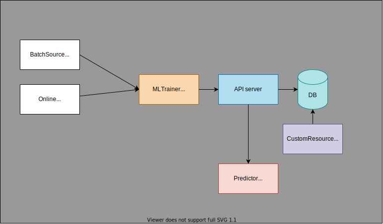

# FM

$$
\bm{w}_{ESPN} \cdot \bm{w}_{Nike} + \bm{w}_{ESPN} \cdot \bm{w}_{Male} + \bm{w}_{Nike} \cdot \bm{w}_{Male}
$$

$$
\phi(\bm{w}, \bm{x}_i) = \sum_{j_{1}=1}^{n} \sum_{j_{2}=1}^{n} (\bm{w}_{j_{1}} \cdot \bm{w}_{j_{2}}) x_{j_{1}} x_{j_{2}}
$$

## Hyperparameter:
- `self.n_factors = n_factors`:

## Parameter:

`a + w*x + sum l[xi]*l[xj]*xi*xj`
1. `self.intercept`
2. `self.weights`
3. `self.latents`

## Implementation memo

1. Deploy trainer
    1. Train batch
    1. Start online training after completing batch training
1. Predictor is a cache that stores parameters
