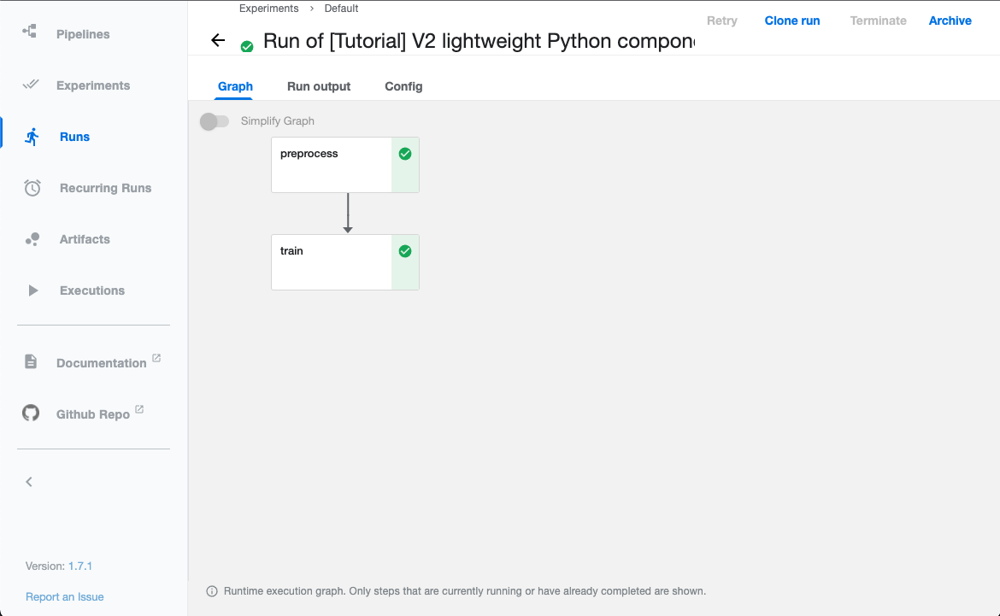

# Kubeflow Pipelines

## Overview


*[from official document architecture overview](https://www.kubeflow.org/docs/components/pipelines/introduction/#architectural-overview)*

Goals:
- *End-to-end orchestration*
- *Easy experimentation*
- *Easy re-use*

Components:
- ***Pipeline***: Definition a ML workflow
- ***Component***: Definition of a step in a pipeline -> `Pod`
- ***Graph***: Visualiazation of piplines
- ***Experiment***: organize your runs into logical groups
- ***Run***: a single execution of a pipeline.
- ***Step***: an execution of one of the components in the pipeline.

## Prerequisite

- [kind](https://kind.sigs.k8s.io/)
- python3

## Getting Started

1. Create K8s cluster in local with `kind`.
    ```bash
    kind create cluster
    ```
1. Create kubeflow pipelines (v1.7.1). (You can check latest version [here](https://github.com/kubeflow/pipelines/releases))
    ```bash
    export PIPELINE_VERSION=1.7.1
    kubectl apply -k "github.com/kubeflow/pipelines/manifests/kustomize/cluster-scoped-resources?ref=$PIPELINE_VERSION"
    kubectl wait --for condition=established --timeout=60s crd/applications.app.k8s.io
    kubectl apply -k "github.com/kubeflow/pipelines/manifests/kustomize/env/platform-agnostic-pns?ref=$PIPELINE_VERSION"
    ```
1. Connect to UI
    ```
    kubectl port-forward -n kubeflow svc/ml-pipeline-ui 8080:80
    ```

    Open http://localhost:8080

    
1. Run a tutorial pipeline by clicking `Create run`.
    

1. Clean up.

    ```
    kubectl delete -k "github.com/kubeflow/pipelines/manifests/kustomize/env/platform-agnostic-pns?ref=$PIPELINE_VERSION"
    kubectl delete -k "github.com/kubeflow/pipelines/manifests/kustomize/cluster-scoped-resources?ref=$PIPELINE_VERSION"
    ```

## Table of Contents

1. [Setup kubeflow pipelines in local](01-setup-kubeflow-pipelines-in-local)
1. [Run tutorial pipelines](02-run-tutorial-pipelines)
1. [Create first pipeline](03-create-first-pipeline)

# Reference
- [AI Platform Pipelines (Kubeflow Pipelines)による機械学習パイプラインの構築と本番導入](https://techblog.zozo.com/entry/aip-pipelines-impl)
- [KubeflowによるMLOps基盤構築から得られた知見と課題](https://techblog.zozo.com/entry/mlops-platform-kubeflow)
- [Vertex Pipelines で動く Kubeflow Pipelines のサンプルを公開しました](https://tech.repro.io/entry/2021/06/22/125113)
