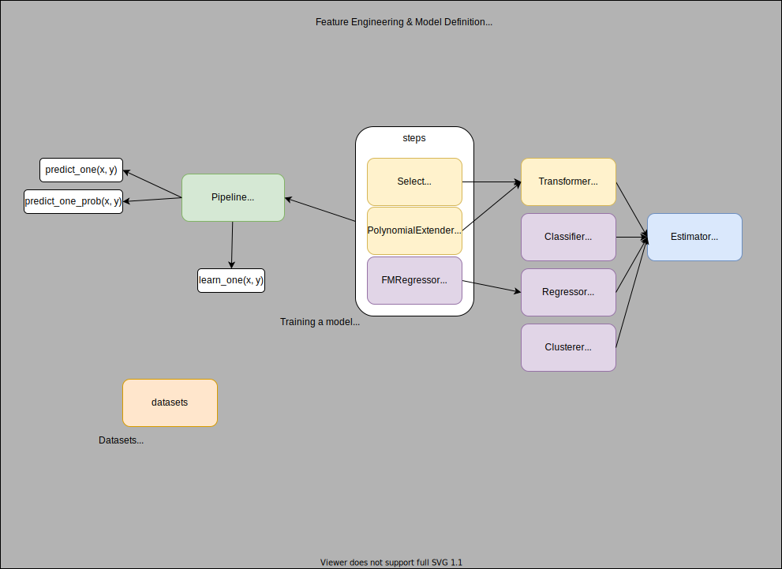

# River

Practice online machine learning library [river](https://github.com/online-ml/river/). For more details, please check [docs](https://riverml.xyz/latest/)



## Versions

river: [](https://github.com/online-ml/river/releases/tag/0.14.0)


## Components

- `Regressor`
- [PredClipper](https://github.com/online-ml/river/blob/main/river/preprocessing/pred_clipper.py): wrap a regressor with max_x and max_y used when prediction

## Contents

- [Quickstart](quickstart)
- [Online Training & Serving](online-training-and-serving)
- [examples](examples)
    - [flask-app](examples/flask-app)
    - [Factorization Machines for datalens](examples/fm-for-datalens)

## Quickstart

1. Change directory

    ```
    cd quickstart
    ```

1. Check python

    ```
    python -V
    Python 3.9.0
    ```

1. Create venv

    ```
    python3 -m venv venv
    ```

    ```
    source venv/bin/activate
    ```

1. Install `river`

    ```
    pip install -r requirements.txt
    ```

1. Run `quickstart.py`

    ```
    python quickstart.py
    ```

    ```
    {'age_of_domain': 1,
    'anchor_from_other_domain': 0.0,
    'empty_server_form_handler': 0.0,
    'https': 0.0,
    'ip_in_url': 1,
    'is_popular': 0.5,
    'long_url': 1.0,
    'popup_window': 0.0,
    'request_from_other_domain': 0.0}
    True
    ```

## Examples

1. [Flask App](examples/flask-app/)
1. [FM for datalens](examples/fm-for-datalens/)

## Reference

https://github.com/online-ml/river
