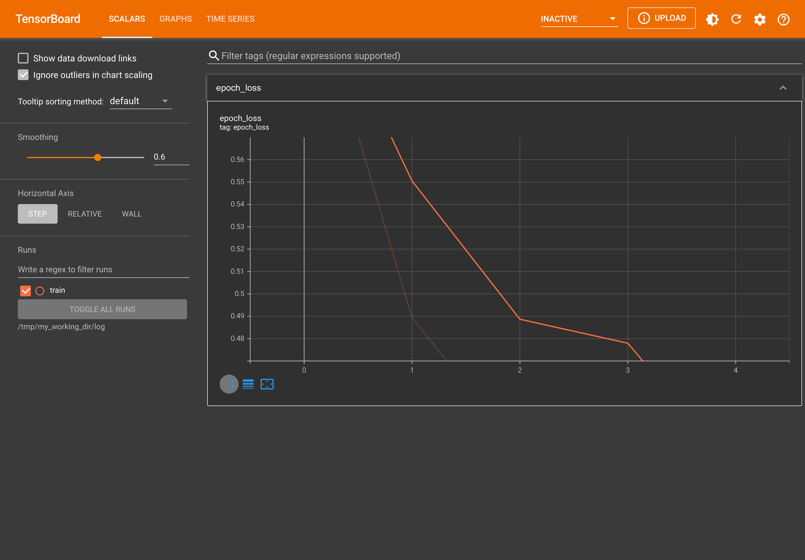

# Tensorflow Training

## Version

tensorflow: [2.13.0](https://github.com/tensorflow/tensorflow/releases/tag/v2.13.0)
## Contents
1. [Parameter Server Training](parameter-server-training)
1. [Multi Worker Mirrored Strategy](multi-worker-mirrored-strategy)
1. [Keras](keras)

## Install

```
pip install tensorflow # pip install tensorflow-macos
```

## Basics

- Dataset:
    1. `batch`: Combines consecutive elements of this dataset into batches.

        ```python
        dataset = tf.data.Dataset.range(8)
        dataset = dataset.batch(3)
        list(dataset.as_numpy_iterator())
        [array([0, 1, 2]), array([3, 4, 5]), array([6, 7])]
        ```

## Tensorboard

```
pip install tensorboard
```

```
tensorboard --logdir /tmp/my_working_dir/log
```



# Errors

## lzma

```
UserWarning: Could not import the lzma module. Your installed Python is incomplete. Attempting to use lzma compression will result in a RuntimeError.
  warnings.warn(msg)
```

```
brew install xz
```

https://zenn.dev/grahamian/articles/f292163325653dbe2c42
