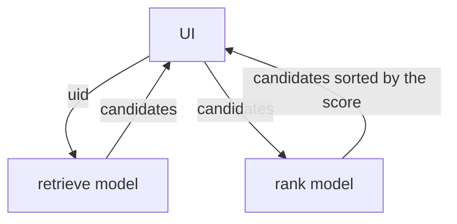
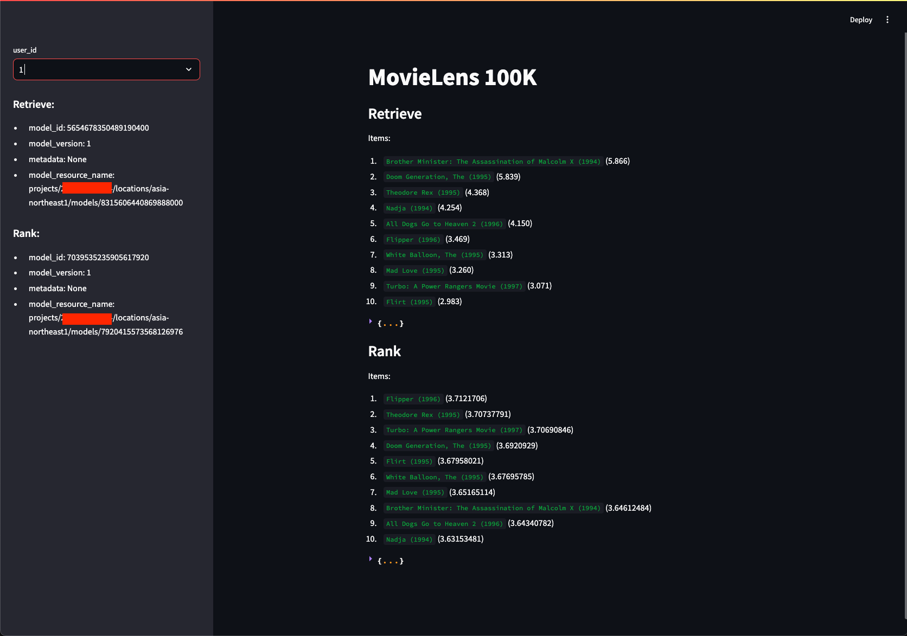

# [Movielens](https://www.tensorflow.org/recommenders/examples/basic_retrieval)

## Version

- tensorflow: 2.17.0
- keras: 2.17.0 (`poetry add tf_keras --group tensorflow`)

## Train and deploy a model

### retrieve

`TF_USE_LEGACY_KERAS=1` is set in `.env` (This is necessary because https://github.com/tensorflow/recommenders/issues/712)

Local

train

```
AIP_MODEL_DIR=models/retrieve poetry run python tensorflow/examples/movielens/retrieve.py
```

The model is saved under `models/retrieve`

```
ls models/retrieve
assets            fingerprint.pb    keras_metadata.pb saved_model.pb    variables
```

Check the saved model

```
poetry run saved_model_cli show --dir models/retrieve --tag_set serve  --signature_def serving_default
The given SavedModel SignatureDef contains the following input(s):
  inputs['input_1'] tensor_info:
      dtype: DT_STRING
      shape: (-1)
      name: serving_default_input_1:0
The given SavedModel SignatureDef contains the following output(s):
  outputs['output_1'] tensor_info:
      dtype: DT_FLOAT
      shape: (-1, 10)
      name: StatefulPartitionedCall:0
  outputs['output_2'] tensor_info:
      dtype: DT_STRING
      shape: (-1, 10)
      name: StatefulPartitionedCall:1
Method name is: tensorflow/serving/predict
```


```
docker run --rm -p 8500:8500 \
  --mount type=bind,source=./models/retrieve/,target=/models/retrieve \
  -e MODEL_NAME=retrieve -t tensorflow/serving
```


> [!NOTE]
> serving (Apple silicon needs to use [bitnami/tensorflow-serving](https://hub.docker.com/r/bitnami/tensorflow-serving) image https://github.com/tensorflow/serving/issues/1948)

M1 Mac

```
docker run --rm -p 8501:8501 \
  --mount type=bind,source=./models/retrieve/,target=/bitnami/model-data/1/ \
  -e TENSORFLOW_SERVING_MODEL_NAME=retrieve --platform="linux/amd64" -t bitnami/tensorflow-serving:2.8.0
```

```
INPUT_DATA_FILE=tensorflow/examples/movielens/input_data_file_retrieve.json
curl \
-X POST \
-H "Content-Type: application/json" \
"http://localhost:8501/v1/models/retrieve:predict" \
-d "@${INPUT_DATA_FILE}"
```

Result:

```
{
    "predictions": [
        {
            "output_1": [3.83519721, 3.72181058, 2.94880295, 2.65641713, 2.65517139, 2.61823225, 2.58621407, 2.52965593, 2.49846315, 2.49338675],
            "output_2": ["Far From Home: The Adventures of Yellow Dog (1995)", "Rent-a-Kid (1995)", "Mirage (1995)", "Just Cause (1995)", "Two if by Sea (1996)", "Jack (1996)", "Rudy (1993)", "Age of Innocence, The (1993)", "Conan the Barbarian (1981)", "Michael (1996)"]
        }
    ]
}
```

GCP:

- [Train a retrieve model on GCP](README_retrieve_train.md)
- [Retrieve model serving on GCP](README_retrieve_serving.md)

### rank

train Rank model and save the model

```
WRAPT_DISABLE_EXTENSIONS=1 poetry run python tensorflow/examples/movielens/rank.py
```

- [Train a rank model on GCP](README_rank_train.md)
- [Rank model serving on GCP](README_rank_serving.md)

## Inference UI

After deploying retrieve and rank models to Vertex AI, following [retrieve](README_retrieve.md) and [rank](README_rank.md).



Create Service Account to generate ID token to invoke the cloud run services (ref: [Generate an ID token by impersonating a service account](https://cloud.google.com/docs/authentication/get-id-token#impersonation))
https://cloud.google.com/run/docs/authenticating/service-to-service#run-service-to-service-example-python

```
gcloud iam service-accounts create movielens-ui --project $PROJECT
gcloud run services add-iam-policy-binding movielens-retrieve \
  --region $REGION \
  --member="serviceAccount:movielens-ui@$PROJECT.iam.gserviceaccount.com" \
  --role="roles/run.invoker" \
  --project $PROJECT
gcloud run services add-iam-policy-binding movielens-rank \
  --region $REGION \
  --member="serviceAccount:movielens-ui@$PROJECT.iam.gserviceaccount.com" \
  --role="roles/run.invoker" \
  --project $PROJECT
```

Run Streamlit UI app with the following command.

```
poetry run streamlit run tensorflow/examples/movielens/ui.py
```



## Data

### ratings

1. bucketized_user_age
1. movie_genres
1. movie_id
1. movie_title
1. raw_user_age
1. timestamp
1. user_gender
1. user_id
1. user_occupation_label
1. user_occupation_text
1. user_rating
1. user_zip_code

### movies

1. movie_genres
1. movie_id
1. movie_title


## Basic Model

1. user_id
1. movie_title

## Embedding

`StringLookup` だと未知のユーザに対して、適当な値を作れない

```py
>>> user_ids_vocabulary = tf.keras.layers.StringLookup(mask_token=None)
>>> user_ids_vocabulary
<StringLookup name=string_lookup_1, built=False>
>>> user_ids_vocabulary.adapt(["uid1", "uid2"])
>>> user_ids_vocabulary
<StringLookup name=string_lookup_1, built=False>
>>> user_ids_vocabulary("uid1")
<tf.Tensor: shape=(), dtype=int64, numpy=2>
>>> user_ids_vocabulary("uid2")
<tf.Tensor: shape=(), dtype=int64, numpy=1>
>>> user_ids_vocabulary("uid3")
<tf.Tensor: shape=(), dtype=int64, numpy=0>
>>> user_ids_vocabulary("uid4")
<tf.Tensor: shape=(), dtype=int64, numpy=0>
>>> user_ids_vocabulary("uid5")
<tf.Tensor: shape=(), dtype=int64, numpy=0>
```

```py
user_model(tf.constant("uid2")) # embeddingを取得できる
```

## Errors

1. [ValueError: Cannot convert '('c', 'o', 'u', 'n', 't', 'e', 'r')' to a shape. Found invalid entry 'c' of type '<class 'str'>' tfrs.metrics.FactorizedTopK](https://github.com/tensorflow/recommenders/issues/712): to be resolved by https://github.com/tensorflow/recommenders/pull/717 or `TF_USE_LEGACY_KERAS=1` with `poetry add tf_keras --group tensorflow`

1. `ValueError: Only input tensors may be passed as positional arguments. The following argument value should be passed as a keyword argument: 42 (of type <class 'str'>)`
    ```diff
    - print(RankingModel()((["42"], ["One Flew Over the Cuckoo's Nest (1975)"])))
    + user_id_tensor = tf.convert_to_tensor(["42"])
    + movie_title_tensor = tf.convert_to_tensor(["One Flew Over the Cuckoo's Nest (1975)"])
    + print(RankingModel()((user_id_tensor, movie_title_tensor)))
    ```

1. `ValueError: TensorFlowTrainer.make_train_function.<locals>.one_step_on_data(data) should not modify its Python input arguments. Modifying a copy is allowed. The following parameter(s) were modified: data`
    `features` is modified with `pop`

    ```diff
    - labels = features.pop("user_rating")
    + copied_features = features.copy()
    + labels = copied_features.pop("user_rating")
    ```
1. `ValueError: could not convert string to float: 'M*A*S*H (1970)'`

    ```diff

      test_ratings[movie_title] = model({
    -     "user_id": np.array(["42"]),
    -     "movie_title": np.array([movie_title])
    +     "user_id": tf.convert_to_tensor(["42"]),
    +     "movie_title": tf.convert_to_tensor([movie_title])
      })
    ```
1. `TypeError: this __dict__ descriptor does not support '_DictWrapper' objects` in `tf.saved_model.save(model, "export")`
    This is Python 3.12 specific issue and workaround is `WRAPT_DISABLE_EXTENSIONS=1 poetry run python tensorflow/examples/movielens/rank.py`
    https://github.com/tensorflow/tensorflow/issues/63548

## Ref

1. [How to Install Google Scalable Nearest Neighbors (ScaNN) on Mac](https://eugeneyan.com/writing/how-to-install-scann-on-mac/)
1. [Efficient serving](https://www.tensorflow.org/recommenders/examples/efficient_serving)
1. Serving
    1. https://www.tensorflow.org/tfx/tutorials/serving/rest_simple
    1. https://www.tensorflow.org/tfx/serving/serving_basic
    1. https://keras.io/examples/keras_recipes/tf_serving <- versioning model
    1. https://github.com/tensorflow/serving/issues/621
    1. https://medium.com/google-cloud/portable-prediction-with-tensorflow-and-cloud-run-669c1c73ebd1
