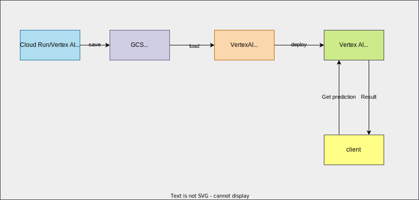

# Movielens - Train a Rank Model



You can also check

- [Vertex AI でレコメンデーションモデルを使う (Custom Training + Deploy to endpoint + Prediction)](https://qiita.com/nakamasato/items/ddf778aef32f3a8421c3)
- [Step-by-Step: Develop a Recommendation System Using Vertex AI (From Custom Training to Deployment with MovieLens dataset)](https://nakamasato.medium.com/step-by-step-develop-a-recommendation-system-using-vertex-ai-from-custom-training-to-deployment-54a4bd31b285)
## Build and push to GCP AR

Custom Container:
- https://cloud.google.com/vertex-ai/docs/training/containers-overview
- https://cloud.google.com/vertex-ai/docs/training/code-requirements


```
export PROJECT=<your project>
```

```
export REGION=asia-northeast1
export REPOSITORY=ml-training
export IMAGE=movielens
export IMAGE_TAG=0.0.2
export APP=rank
```


```
poetry export -f requirements.txt --output tensorflow/examples/movielens/requirements.txt --only=tensorflow --without-hashes
```

```
cd tensorflow/examples/movielens/
gcloud builds submit \
    --config "cloudbuild.train.yaml" \
    --project "${PROJECT}" \
    --substitutions="_IMAGE_TAG=${IMAGE_TAG},_IMAGE_NAME=${IMAGE},_REPOSITORY=${REPOSITORY},_REGION=${REGION},_PROJECT=${PROJECT}" \
    --gcs-source-staging-dir="gs://${PROJECT}-cloudbuild/source"
```

## Train Model

### Option1: Train model on Cloud Run ✅️

```
gcloud run jobs deploy ml-training-movielens-rank --command=python --args=rank.py --memory 4Gi --cpu 2 --image "$REGION-docker.pkg.dev/$PROJECT/$REPOSITORY/$IMAGE:$IMAGE_TAG" --set-env-vars=AIP_MODEL_DIR=gs://${PROJECT}-ml-training/movielens/cloudrun/rank --set-env-vars=TF_USE_LEGACY_KERAS=1 --max-retries 0 --region $REGION --project $PROJECT
```

```
gcloud run jobs execute ml-training-movielens-rank --region $REGION --project $PROJECT
```


### Option2: Train model on Vertex AI ✅️

Submit Custom Job without autopacking

- [Create Custom Job with gcloud](https://cloud.google.com/vertex-ai/docs/training/create-custom-job#create_custom_job-gcloud)
- [Envvar for special GCS dir](https://cloud.google.com/vertex-ai/docs/training/code-requirements#environment-variables)

Prepare config file

```
APP=rank envsubst < tensorflow/examples/movielens/vertexaiconfig.template.yaml > tensorflow/examples/movielens/vertexaiconfig.rank.yaml
```

Submit job

```
gcloud ai custom-jobs create --region=$REGION --display-name="movielens-rank" --config=tensorflow/examples/movielens/vertexaiconfig.rank.yaml --project $PROJECT
```
