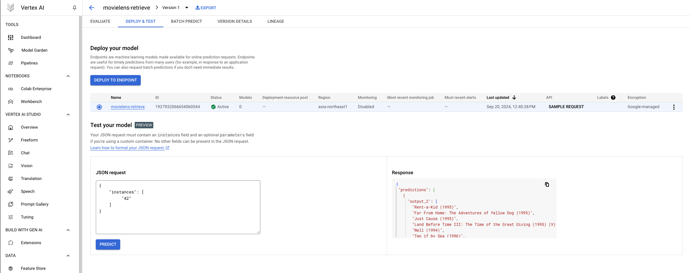

# Movielens - Retrieve

You can also check [Vertex AI でレコメンデーションモデルを使う (Custom Training + Deploy to endpoint + Prediction)](https://qiita.com/nakamasato/items/ddf778aef32f3a8421c3)

## Build and push to GCP AR

Custom Container:
- https://cloud.google.com/vertex-ai/docs/training/containers-overview
- https://cloud.google.com/vertex-ai/docs/training/code-requirements

```
export PROJECT=<your project>
```

```
export REGION=asia-northeast1
export REPOSITORY=ml-training
export IMAGE=movielens
export APP=retrieve
export IMAGE_TAG=0.0.1
```


```
poetry export -f requirements.txt --output tensorflow/examples/movielens/requirements.txt --only=tensorflow --without-hashes
```

build locally

```
pack build --platform linux/amd64 --builder heroku/builder:22 $IMAGE --path tensorflow/examples/movielens
```

run locally

```
docker run --rm $IMAGE python retrieve.py
```

build and publish (❌)

mac: `--platform linux/amd64`
linux: `--platform linux/amd64`

```
gcloud auth login
gcloud auth configure-docker asia-northeast1-docker.pkg.dev
pack build "$REGION-docker.pkg.dev/$PROJECT/$REPOSITORY/$IMAGE:$IMAGE_TAG" \
    --env "GOOGLE_ENTRYPOINT='web: python retrieve.py'" \
    --tag "$REGION-docker.pkg.dev/$PROJECT/$REPOSITORY/$IMAGE:latest" \
    --path tensorflow/examples/movielens \
    --builder heroku/builder:22 \
    --publish
```

```
docker buildx build --platform linux/amd64 -f tensorflow/examples/movielens/Dockerfile -t $IMAGE:$IMAGE_TAG tensorflow/examples/movielens
docker tag $IMAGE:$IMAGE_TAG "$REGION-docker.pkg.dev/$PROJECT/$REPOSITORY/$IMAGE:$IMAGE_TAG"
docker push "$REGION-docker.pkg.dev/$PROJECT/$REPOSITORY/$IMAGE:$IMAGE_TAG"
```

> [!WARN]
> Local build didn't work due to the following error
> -> `terminated: Application failed to start: "/usr/local/bin/python" exec format error`

```
cd tensorflow/examples/movielens/
gcloud builds submit \
    --config "cloudbuild.yaml" \
    --project "${PROJECT}" \
    --substitutions="_IMAGE_TAG=${IMAGE_TAG},_IMAGE_NAME=${IMAGE},_REPOSITORY=${REPOSITORY},_REGION=${REGION},_PROJECT=${PROJECT}" \
    --gcs-source-staging-dir="gs://${PROJECT}-cloudbuild/source"
```

## Train Model

### Option1: Run on Cloud Run ✅️

memo: `--command=python --args=retrieve.py --set-env-vars=PYTHONPATH=/workspace/` for image built by buildpacks

```
gcloud run jobs deploy ml-training-movielens-$APP --args=$APP.py --memory 4Gi --cpu 2 --image "$REGION-docker.pkg.dev/$PROJECT/$REPOSITORY/$IMAGE:$IMAGE_TAG" --set-env-vars=AIP_MODEL_DIR=gs://${PROJECT}-ml-training/movielens/cloudrun/$APP/model-output --set-env-vars=TF_USE_LEGACY_KERAS=1 --max-retries 0 --region $REGION --project $PROJECT
```

```
gcloud run jobs execute ml-training-movielens-$APP --region $REGION --project $PROJECT
```

> [!WARN]
> `"ValueError: Cannot convert '('c', 'o', 'u', 'n', 't', 'e', 'r')' to a shape. Found invalid entry 'c' of type '<class 'str'>'. "`

-> `--set-env-vars=TF_USE_LEGACY_KERAS=1` is necessary ✅️

You can check the saved model:

```
cloud storage ls "gs://${PROJECT}-ml-training/movielens/cloudrun/retrieve/model-output/"
gs://PROJECT-ml-training/movielens/cloudrun/retrieve/model-output/

gs://PROJECT-ml-training/movielens/cloudrun/retrieve/model-output/:
gs://PROJECT-ml-training/movielens/cloudrun/retrieve/model-output/
gs://PROJECT-ml-training/movielens/cloudrun/retrieve/model-output/fingerprint.pb
gs://PROJECT-ml-training/movielens/cloudrun/retrieve/model-output/keras_metadata.pb
gs://PROJECT-ml-training/movielens/cloudrun/retrieve/model-output/saved_model.pb
gs://PROJECT-ml-training/movielens/cloudrun/retrieve/model-output/assets/
gs://PROJECT-ml-training/movielens/cloudrun/retrieve/model-output/model/
gs://PROJECT-ml-training/movielens/cloudrun/retrieve/model-output/variables/
```

### Option2: Run on VertexAI ✅️

> [!WARN]
>
> Local Run (❌️ `WARNING: The requested image's platform (linux/amd64) does not match the detected host platform (linux/arm64/v8) and no specific platform was requested`)
>
> ```
> gcloud ai custom-jobs local-run --executor-image-uri="$REGION-docker.pkg.dev/$PROJECT/$REPOSITORY/$IMAGE:$IMAGE_TAG" --project $PROJECT
> ```

Submit Custom Job without autopacking

- [Create Custom Job with gcloud](https://cloud.google.com/vertex-ai/docs/training/create-custom-job#create_custom_job-gcloud)
- [Envvar for special GCS dir](https://cloud.google.com/vertex-ai/docs/training/code-requirements#environment-variables)

Prepare config file

```
APP=retrieve envsubst < tensorflow/examples/movielens/vertexaiconfig.template.yaml > tensorflow/examples/movielens/vertexaiconfig.retrieve.yaml
```

Submit job

```
gcloud ai custom-jobs create --region=$REGION --display-name="movielens-retrieve" --config=tensorflow/examples/movielens/vertexaiconfig.retrieve.yaml --project $PROJECT
```

## Deploy serving

### [Import model from GCS](https://cloud.google.com/vertex-ai/docs/model-registry/import-model#custom-container)

With the following command, we load the model built with Vertex AI:

```
gcloud ai models upload \
  --region=$REGION \
  --display-name=movielens-retrieve \
  --container-image-uri=asia-docker.pkg.dev/vertex-ai-restricted/prediction/tf_opt-cpu.nightly:latest \
  --artifact-uri=gs://${PROJECT}-ml-training/movielens/vertexai/model-output/model/ \
  --project=$PROJECT
```

```
gcloud ai models list --project $PROJECT --region $REGION
MODEL_ID             DISPLAY_NAME
2548324905556901888  movielens-retrieve
```

- **artifact-uri**: the directory that contains your model artifacts (`saved_model.pb` for TensorFlow)
- **container image uri**: The URI of the container image to use for serving predictions.
    - https://cloud.google.com/vertex-ai/docs/predictions/pre-built-containers
    - https://cloud.google.com/vertex-ai/docs/predictions/optimized-tensorflow-runtime

### [Deploy model to endpoint](https://cloud.google.com/vertex-ai/docs/general/deployment)

Create a new endpoint (not dedicated endpoint for traffic split)

```
gcloud ai endpoints create \
  --region=$REGION \
  --display-name=movielens-retrieve --project $PROJECT
```

<details><summary>alternatively dedicated endpoint</summary>

Here, we deploy the model to a dedicated endpoint

```
curl -X POST \
-H "Authorization: Bearer $(gcloud auth print-access-token)" \
-H "Content-Type: application/json" \
-d '{"display_name": "movielens-retrieve", "dedicatedEndpointEnabled": true}' \
https://$REGION-aiplatform.googleapis.com/v1/projects/$PROJECT/locations/$REGION/endpoints
```

> [!WARN] The create operation is invisible and it takes time to get visible by `gcloud ai endpoints list --region $REGION --project $PROJECT`.

</details>

Check the endpoint

```
gcloud ai endpoints list --region=$REGION --project $PROJECT
ENDPOINT_ID          DISPLAY_NAME
2891702386911346688  movielens
```

Deploy the latest model

```
ENDPOINT=$(gcloud ai endpoints list --region=$REGION --filter=display_name=movielens-retrieve --project $PROJECT --format="json(name)" | jq -r '.[0].name')
MODEL_ID=$(gcloud ai models list --filter=display_name=movielens-retrieve --region $REGION --project $PROJECT --sort-by=~versionUpdateTime --format 'json(name)' | jq -r '.[0].name' | sed 's/.*\/\(\d*\)/\1/')
```

```
gcloud ai endpoints deploy-model $ENDPOINT \
  --region=$REGION \
  --model=$MODEL_ID \
  --display-name=movielens-retrieve \
  --machine-type=n2-standard-2 \
  --min-replica-count=1 \
  --max-replica-count=1 \
  --traffic-split=0=100 \
  --project $PROJECT
```

> [!INFO]
> This takes 5~10 mins.

Check your endpoint

```
gcloud ai endpoints describe $ENDPOINT \
    --project=$PROJECT \
    --region=$REGION
```


### Predict

prepare `input_data_file_retrieve.json`:

```json
{
    "instances": [
         "42"
    ]
}
```

```
ENDPOINT_ID=$(gcloud ai endpoints list --region=$REGION --filter=display_name=movielens-retrieve --project $PROJECT --format="json(name)" | jq -r '.[0].name' | sed 's/.*\/\(\d*\)/\1/')
INPUT_DATA_FILE=tensorflow/examples/movielens/input_data_file_retrieve.json
```

```
curl \
-X POST \
-H "Authorization: Bearer $(gcloud auth print-access-token)" \
-H "Content-Type: application/json" \
"https://$REGION-aiplatform.googleapis.com/v1/projects/$PROJECT/locations/$REGION/endpoints/$ENDPOINT_ID:predict" \
-d "@${INPUT_DATA_FILE}"
```

> [!NOTE]
> If you encounter the following error
>
> ```
> {
>   "error": {
>     "code": 400,
>     "message": "This endpoint is a dedicated endpoint via CloudESF and cannot be accessed through the Vertex AI API. Please access the endpoint using its dedicated dns name '<endpoint_id>.asia-northeast1-<project number>.prediction.vertexai.goog'",
>     "status": "FAILED_PRECONDITION"
>   }
> }
> ```
> you can use the following command:
> ```
> DEDICATED_DNS=$(gcloud ai endpoints describe $ENDPOINT \
>    --project=$PROJECT \
>    --region=$REGION --format json | jq -r '.dedicatedEndpointDns')
> ```


Result:

```json
{
  "predictions": [
    {
      "output_2": [
        "Rent-a-Kid (1995)",
        "Far From Home: The Adventures of Yellow Dog (1995)",
        "Just Cause (1995)",
        "Land Before Time III: The Time of the Great Giving (1995) (V)",
        "Nell (1994)",
        "Two if by Sea (1996)",
        "Jack (1996)",
        "Panther (1995)",
        "House Arrest (1996)",
        "Conan the Barbarian (1981)"
      ],
      "output_1": [
        3.94025946,
        3.47775483,
        3.4017539,
        3.32554197,
        2.95510435,
        2.63177681,
        2.61488819,
        2.61403036,
        2.58744907,
        2.54093599
      ]
    }
  ],
  "deployedModelId": "535000367843246080",
  "model": "projects/xxxx/locations/asia-northeast1/models/2548324905556901888",
  "modelDisplayName": "movielens-retrieve",
  "modelVersionId": "1"
}
```



### Undeploy

```
ENDPOINT=$(gcloud ai endpoints list --region=$REGION --filter=display_name=movielens-retrieve --project $PROJECT --format="json(name)" | jq -r '.[0].name')
DEPLOYED_MODEL_ID=$(gcloud ai models describe $MODEL_ID  --region $REGION --project $PROJECT --format 'json('deployedModels')' | jq -r '.deployedModels[].deployedModelId')
gcloud ai endpoints undeploy-model $ENDPOINT \
    --project=$PROJECT \
    --region=$REGION \
    --deployed-model-id=$DEPLOYED_MODEL_ID
```

```
gcloud ai endpoints delete $ENDPOINT \
    --project=$PROJECT \
    --region=$REGION
```
