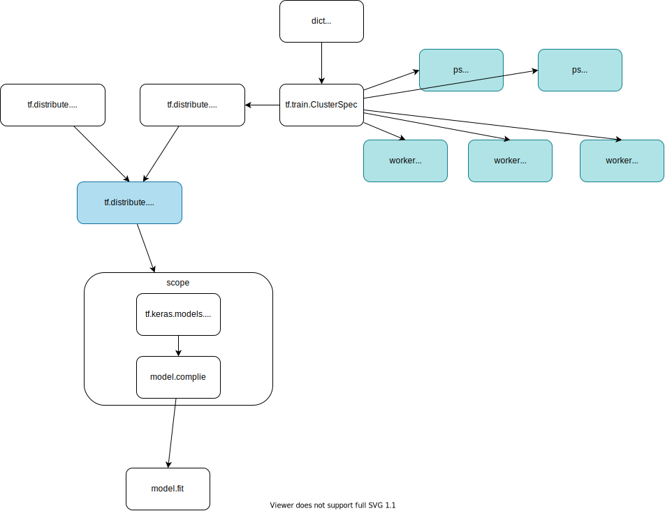

# [Distributed Training with ParameterServerStrategy](https://www.tensorflow.org/tutorials/distribute/parameter_server_training) (Experimental)

## Version

- Python: 3.9.0
- TensorFlow: [2.8.0](https://github.com/tensorflow/tensorflow/releases/tag/v2.8.0)

## [Tensorflow Distributed Training](https://www.tensorflow.org/api_docs/python/tf/distribute)

Strategies:
1. [tf.distribute.MirroredStrategy](https://www.tensorflow.org/api_docs/python/tf/distribute/MirroredStrategy)
    - Single machine with multiple GPUs (one replica per GPU device)
    - Synchronous
1. [tf.distribute.MultiWorkerMirroredStrategy](https://www.tensorflow.org/api_docs/python/tf/distribute/MultiWorkerMirroredStrategy)
    - Multiple machines
    - Synchronous
1. [tf.distribute.experimental.ParameterServerStrategy](https://www.tensorflow.org/api_docs/python/tf/distribute/experimental/ParameterServerStrategy) <- Here we'll study this.
    - Multiple machines
    - Asynchronous

Synchronous vs Asynchronous (Data parallelism)
- **sync**: all workers train over different slices of input data in sync, and aggregating gradients at each step -> all-reduce
- **async**: all workers are independently training over the input data and updating variables asynchronously -> parameter server architecture

- [Distributed Training Tutorials](https://www.tensorflow.org/tutorials/distribute/)
- [Distirbuted Training](https://www.tensorflow.org/guide/distributed_training)

## Components
1. one ***coordinator*** job (`chief`):  runs your training program, one or several workers and parameter server tasks that run TensorFlow servers—tf.distribute.Server
1. multiple ***worker*** jobs (`worker`)
1. multiple ***parameter server*** jobs (`ps`)
1. ***evaluator***

## Setup

create virtual env

```
python3 -m venv venv
. venv/bin/activate
python3 -m pip install --upgrade pip
```

install dependencies

```
pip install tensorflow portpicker
```

## Practice 1 - [Create In-process cluster](https://www.tensorflow.org/tutorials/distribute/parameter_server_training#in-process_cluster)

How to run:
```
python train_in_process_cluster.py
```

<details><summary>result</summary>

```
python train_in_process_cluster.py
{'worker': ['localhost:19099', 'localhost:20110', 'localhost:15778'], 'ps': ['localhost:15054', 'localhost:20378']}
2022-02-23 16:09:28.575010: I tensorflow/core/platform/cpu_feature_guard.cc:151] This TensorFlow binary is optimized with oneAPI Deep Neural Network Library (oneDNN) to use the following CPU instructions in performance-critical operations:  AVX2 FMA
To enable them in other operations, rebuild TensorFlow with the appropriate compiler flags.
2022-02-23 16:09:28.578339: I tensorflow/core/distributed_runtime/rpc/grpc_channel.cc:272] Initialize GrpcChannelCache for job ps -> {0 -> localhost:15054, 1 -> localhost:20378}
2022-02-23 16:09:28.578360: I tensorflow/core/distributed_runtime/rpc/grpc_channel.cc:272] Initialize GrpcChannelCache for job worker -> {0 -> localhost:19099, 1 -> localhost:20110, 2 -> localhost:15778}
2022-02-23 16:09:28.578509: I tensorflow/core/distributed_runtime/rpc/grpc_server_lib.cc:437] Started server with target: grpc://localhost:19099
2022-02-23 16:09:28.582469: I tensorflow/core/distributed_runtime/rpc/grpc_channel.cc:272] Initialize GrpcChannelCache for job ps -> {0 -> localhost:15054, 1 -> localhost:20378}
2022-02-23 16:09:28.582500: I tensorflow/core/distributed_runtime/rpc/grpc_channel.cc:272] Initialize GrpcChannelCache for job worker -> {0 -> localhost:19099, 1 -> localhost:20110, 2 -> localhost:15778}
2022-02-23 16:09:28.582654: I tensorflow/core/distributed_runtime/rpc/grpc_server_lib.cc:437] Started server with target: grpc://localhost:20110
2022-02-23 16:09:28.591058: I tensorflow/core/distributed_runtime/rpc/grpc_channel.cc:272] Initialize GrpcChannelCache for job ps -> {0 -> localhost:15054, 1 -> localhost:20378}
2022-02-23 16:09:28.591087: I tensorflow/core/distributed_runtime/rpc/grpc_channel.cc:272] Initialize GrpcChannelCache for job worker -> {0 -> localhost:19099, 1 -> localhost:20110, 2 -> localhost:15778}
2022-02-23 16:09:28.591246: I tensorflow/core/distributed_runtime/rpc/grpc_server_lib.cc:437] Started server with target: grpc://localhost:15778
2022-02-23 16:09:28.594420: I tensorflow/core/distributed_runtime/rpc/grpc_channel.cc:272] Initialize GrpcChannelCache for job ps -> {0 -> localhost:15054, 1 -> localhost:20378}
2022-02-23 16:09:28.594447: I tensorflow/core/distributed_runtime/rpc/grpc_channel.cc:272] Initialize GrpcChannelCache for job worker -> {0 -> localhost:19099, 1 -> localhost:20110, 2 -> localhost:15778}
2022-02-23 16:09:28.594566: I tensorflow/core/distributed_runtime/rpc/grpc_server_lib.cc:437] Started server with target: grpc://localhost:15054
2022-02-23 16:09:28.597554: I tensorflow/core/distributed_runtime/rpc/grpc_channel.cc:272] Initialize GrpcChannelCache for job ps -> {0 -> localhost:15054, 1 -> localhost:20378}
2022-02-23 16:09:28.597578: I tensorflow/core/distributed_runtime/rpc/grpc_channel.cc:272] Initialize GrpcChannelCache for job worker -> {0 -> localhost:19099, 1 -> localhost:20110, 2 -> localhost:15778}
2022-02-23 16:09:28.597715: I tensorflow/core/distributed_runtime/rpc/grpc_server_lib.cc:437] Started server with target: grpc://localhost:20378
2022-02-23 16:09:28.619820: I tensorflow/core/distributed_runtime/rpc/grpc_channel.cc:272] Initialize GrpcChannelCache for job ps -> {0 -> localhost:15054, 1 -> localhost:20378}
2022-02-23 16:09:28.619850: I tensorflow/core/distributed_runtime/rpc/grpc_channel.cc:272] Initialize GrpcChannelCache for job worker -> {0 -> localhost:19099, 1 -> localhost:20110, 2 -> localhost:15778}
2022-02-23 16:09:28.619859: I tensorflow/core/distributed_runtime/rpc/grpc_channel.cc:272] Initialize GrpcChannelCache for job chief -> {0 -> localhost:50435}
2022-02-23 16:09:28.637740: I tensorflow/core/distributed_runtime/rpc/grpc_channel.cc:272] Initialize GrpcChannelCache for job ps -> {0 -> localhost:15054, 1 -> localhost:20378}
2022-02-23 16:09:28.637766: I tensorflow/core/distributed_runtime/rpc/grpc_channel.cc:272] Initialize GrpcChannelCache for job worker -> {0 -> localhost:19099, 1 -> localhost:20110, 2 -> localhost:15778}
2022-02-23 16:09:28.637780: I tensorflow/core/distributed_runtime/rpc/grpc_channel.cc:272] Initialize GrpcChannelCache for job chief -> {0 -> localhost:50435}
2022-02-23 16:09:28.637841: I tensorflow/core/distributed_runtime/rpc/grpc_channel.cc:272] Initialize GrpcChannelCache for job ps -> {0 -> localhost:15054, 1 -> localhost:20378}
2022-02-23 16:09:28.637886: I tensorflow/core/distributed_runtime/rpc/grpc_channel.cc:272] Initialize GrpcChannelCache for job worker -> {0 -> localhost:19099, 1 -> localhost:20110, 2 -> localhost:15778}
2022-02-23 16:09:28.637917: I tensorflow/core/distributed_runtime/rpc/grpc_channel.cc:272] Initialize GrpcChannelCache for job chief -> {0 -> localhost:50435}
2022-02-23 16:09:28.637952: I tensorflow/core/distributed_runtime/eager/eager_service_impl.cc:279] Creating sync eager service context with rendezvous_id on host PCN-747.local /job:ps/replica:0/task:0
2022-02-23 16:09:28.638018: I tensorflow/core/distributed_runtime/eager/eager_service_impl.cc:279] Creating sync eager service context with rendezvous_id on host PCN-747.local /job:ps/replica:0/task:1
2022-02-23 16:09:28.638072: I tensorflow/core/distributed_runtime/rpc/grpc_channel.cc:272] Initialize GrpcChannelCache for job ps -> {0 -> localhost:15054, 1 -> localhost:20378}
2022-02-23 16:09:28.638097: I tensorflow/core/distributed_runtime/rpc/grpc_channel.cc:272] Initialize GrpcChannelCache for job worker -> {0 -> localhost:19099, 1 -> localhost:20110, 2 -> localhost:15778}
2022-02-23 16:09:28.638108: I tensorflow/core/distributed_runtime/rpc/grpc_channel.cc:272] Initialize GrpcChannelCache for job chief -> {0 -> localhost:50435}
2022-02-23 16:09:28.638143: I tensorflow/core/distributed_runtime/rpc/grpc_channel.cc:272] Initialize GrpcChannelCache for job ps -> {0 -> localhost:15054, 1 -> localhost:20378}
2022-02-23 16:09:28.638166: I tensorflow/core/distributed_runtime/rpc/grpc_channel.cc:272] Initialize GrpcChannelCache for job worker -> {0 -> localhost:19099, 1 -> localhost:20110, 2 -> localhost:15778}
2022-02-23 16:09:28.638180: I tensorflow/core/distributed_runtime/rpc/grpc_channel.cc:272] Initialize GrpcChannelCache for job chief -> {0 -> localhost:50435}
2022-02-23 16:09:28.638204: I tensorflow/core/distributed_runtime/eager/eager_service_impl.cc:279] Creating sync eager service context with rendezvous_id on host PCN-747.local /job:worker/replica:0/task:0
2022-02-23 16:09:28.638257: I tensorflow/core/distributed_runtime/rpc/grpc_channel.cc:272] Initialize GrpcChannelCache for job ps -> {0 -> localhost:15054, 1 -> localhost:20378}
2022-02-23 16:09:28.638299: I tensorflow/core/distributed_runtime/rpc/grpc_channel.cc:272] Initialize GrpcChannelCache for job worker -> {0 -> localhost:19099, 1 -> localhost:20110, 2 -> localhost:15778}
2022-02-23 16:09:28.639155: I tensorflow/core/distributed_runtime/eager/eager_service_impl.cc:279] Creating sync eager service context with rendezvous_id on host PCN-747.local /job:worker/replica:0/task:1
2022-02-23 16:09:28.639194: I tensorflow/core/distributed_runtime/rpc/grpc_channel.cc:272] Initialize GrpcChannelCache for job chief -> {0 -> localhost:50435}
2022-02-23 16:09:28.639314: I tensorflow/core/distributed_runtime/eager/eager_service_impl.cc:279] Creating sync eager service context with rendezvous_id on host PCN-747.local /job:worker/replica:0/task:2
2022-02-23 16:09:28.640145: I tensorflow/core/distributed_runtime/rpc/grpc_channel.cc:272] Initialize GrpcChannelCache for job ps -> {0 -> localhost:15054, 1 -> localhost:20378}
2022-02-23 16:09:28.640164: I tensorflow/core/distributed_runtime/rpc/grpc_channel.cc:272] Initialize GrpcChannelCache for job worker -> {0 -> localhost:19099, 1 -> localhost:20110, 2 -> localhost:15778}
2022-02-23 16:09:28.640173: I tensorflow/core/distributed_runtime/rpc/grpc_channel.cc:272] Initialize GrpcChannelCache for job chief -> {0 -> localhost:50435}
2022-02-23 16:09:28.640405: I tensorflow/core/distributed_runtime/rpc/grpc_server_lib.cc:437] Started server with target: grpc://localhost:50435
Epoch 1/5
2022-02-23 16:09:30.521664: W tensorflow/core/framework/dataset.cc:768] Input of GeneratorDatasetOp::Dataset will not be optimized because the dataset does not implement the AsGraphDefInternal() method needed to apply optimizations.
2022-02-23 16:09:30.862058: W tensorflow/python/util/util.cc:368] Sets are not currently considered sequences, but this may change in the future, so consider avoiding using them.
2022-02-23 16:09:31.117050: I tensorflow/core/common_runtime/eager/kernel_and_device.cc:94] Ignoring error status when releasing multi-device function handle UNIMPLEMENTED: Releasing a multi-device component handle on a remote device is not yet implemented.
2022-02-23 16:09:31.218624: I tensorflow/core/common_runtime/eager/kernel_and_device.cc:94] Ignoring error status when releasing multi-device function handle UNIMPLEMENTED: Releasing a multi-device component handle on a remote device is not yet implemented.
20/20 - 2s - loss: 0.4735 - 2s/epoch - 119ms/step
Epoch 2/5
2022-02-23 16:09:31.663319: I tensorflow/core/common_runtime/eager/kernel_and_device.cc:94] Ignoring error status when releasing multi-device function handle UNIMPLEMENTED: Releasing a multi-device component handle on a remote device is not yet implemented.
2022-02-23 16:09:31.766621: I tensorflow/core/common_runtime/eager/kernel_and_device.cc:94] Ignoring error status when releasing multi-device function handle UNIMPLEMENTED: Releasing a multi-device component handle on a remote device is not yet implemented.
20/20 - 1s - loss: 0.4695 - 548ms/epoch - 27ms/step
Epoch 3/5
WARNING:tensorflow:5 out of the last 5 calls to <function MultiDeviceSaver.save.<locals>.tf_function_save at 0x144ec5440> triggered tf.function retracing. Tracing is expensive and the excessive number of tracings could be due to (1) creating @tf.function repeatedly in a loop, (2) passing tensors with different shapes, (3) passing Python objects instead of tensors. For (1), please define your @tf.function outside of the loop. For (2), @tf.function has experimental_relax_shapes=True option that relaxes argument shapes that can avoid unnecessary retracing. For (3), please refer to https://www.tensorflow.org/guide/function#controlling_retracing and https://www.tensorflow.org/api_docs/python/tf/function for  more details.
2022-02-23 16:09:32.069889: I tensorflow/core/common_runtime/eager/kernel_and_device.cc:94] Ignoring error status when releasing multi-device function handle UNIMPLEMENTED: Releasing a multi-device component handle on a remote device is not yet implemented.
WARNING:tensorflow:6 out of the last 6 calls to <function MultiDeviceSaver.save.<locals>.tf_function_save at 0x144436c20> triggered tf.function retracing. Tracing is expensive and the excessive number of tracings could be due to (1) creating @tf.function repeatedly in a loop, (2) passing tensors with different shapes, (3) passing Python objects instead of tensors. For (1), please define your @tf.function outside of the loop. For (2), @tf.function has experimental_relax_shapes=True option that relaxes argument shapes that can avoid unnecessary retracing. For (3), please refer to https://www.tensorflow.org/guide/function#controlling_retracing and https://www.tensorflow.org/api_docs/python/tf/function for  more details.
2022-02-23 16:09:32.168466: I tensorflow/core/common_runtime/eager/kernel_and_device.cc:94] Ignoring error status when releasing multi-device function handle UNIMPLEMENTED: Releasing a multi-device component handle on a remote device is not yet implemented.
20/20 - 0s - loss: 0.3233 - 399ms/epoch - 20ms/step
Epoch 4/5
2022-02-23 16:09:32.461124: I tensorflow/core/common_runtime/eager/kernel_and_device.cc:94] Ignoring error status when releasing multi-device function handle UNIMPLEMENTED: Releasing a multi-device component handle on a remote device is not yet implemented.
2022-02-23 16:09:32.564254: I tensorflow/core/common_runtime/eager/kernel_and_device.cc:94] Ignoring error status when releasing multi-device function handle UNIMPLEMENTED: Releasing a multi-device component handle on a remote device is not yet implemented.
20/20 - 0s - loss: 0.2525 - 394ms/epoch - 20ms/step
Epoch 5/5
2022-02-23 16:09:32.865759: I tensorflow/core/common_runtime/eager/kernel_and_device.cc:94] Ignoring error status when releasing multi-device function handle UNIMPLEMENTED: Releasing a multi-device component handle on a remote device is not yet implemented.
2022-02-23 16:09:32.966158: I tensorflow/core/common_runtime/eager/kernel_and_device.cc:94] Ignoring error status when releasing multi-device function handle UNIMPLEMENTED: Releasing a multi-device component handle on a remote device is not yet implemented.
20/20 - 0s - loss: 0.2695 - 399ms/epoch - 20ms/step
```

</details>

Overview:


Steps:
1. Set up `ClusterSpec` with `{'worker': ['<host>:<port>', ...], 'ps': ['<host>:<port>', ...]}` with random ports by `portpicker`.
    ```python
    cluster_spec = tf.train.ClusterSpec({'worker': ['localhost:19099', 'localhost:20110', 'localhost:15778'], 'ps': ['localhost:15054', 'localhost:20378']})
    ```
1. Initialize 3 `Worker`s and 2 `PS`s with ` tf.distribute.Server`.
1. Instantiate [SimpleClusterResolver](https://www.tensorflow.org/api_docs/python/tf/distribute/cluster_resolver/SimpleClusterResolver).
    ```python
    cluster_resolver = tf.distribute.cluster_resolver.SimpleClusterResolver(
        cluster_spec, rpc_layer="grpc"
    )
    ```
1. Variable sharding `tf.distribute.experimental.partitioners.MinSizePartitioner`.
    ```python
    variable_partitioner = tf.distribute.experimental.partitioners.MinSizePartitioner(
        min_shard_bytes=(256 << 10), max_shards=NUM_PS
    )
    ```
1. Instantiate `ParameterServerStrategy` with cluster resolver and variable partitioner.
    ```python
    strategy = tf.distribute.experimental.ParameterServerStrategy(
        cluster_resolver, variable_partitioner=variable_partitioner
    )
    ```
1. Train a model: (there are several ways)
    1. Prepara data
    1. Build a model
    1. Traing the model

## practice 2 - distributed vs. non-distributed

```
python non_distributed_sample.py
```

1. Create `tf.Variable`.
1. Define `worker_fn` with `tf.function`.
1. Create an iterator with 1~5.
1. Call `worker_fn` with the iterator.
1. Expect `tf.Variable` to be 15.

```
python distributed_sample.py
```

1. Create in-process cluster.
1. Initialize distributed strategy.
1. Initialize the coodinator.
1. Create `tf.Variable` in `strategy.scope()`.
1. Define `worker_fn` with `tf.function`.
1. Create an iterator with 1~5.
1. Call `worker_fn` with `coordinator.schedul()` five times.
1. Expect `tf.Variable` to be 15.

## practice 2 - Training with Keras.models

```
python train_with_keras.py
```
1. Create in-process cluster.
1. Initialize `DatasetCreator` with `dataset_fn`.
    ```python
    dc = tf.keras.utils.experimental.DatasetCreator(dataset_fn)
    ```

    When using keras.Model with ParameterServerStrategy, you need to use DatasetCreator for input data.

1. Initialize a model within the `strategy.scope()`.
    ```python
    with strategy.scope():
        model = tf.keras.models.Sequential([tf.keras.layers.Dense(10)])
        model.compile(tf.keras.optimizers.SGD(), loss="mse", steps_per_execution=10)
    ```
1. Training with with `Model.fit`
    ```
    model.fit(dc, epochs=5, steps_per_epoch=20, callbacks=callbacks)
    ```

    `keras.Model`:
    1. Internally stores the distributed strategy: [keras.Model.\_\_init\_\_](https://github.com/keras-team/keras/blob/d8fcb9d4d4dad45080ecfdd575483653028f8eda/keras/engine/training.py#L260-L264)
        ```python
        self._distribution_strategy = tf.distribute.get_strategy()
        ```
    1. Creates `ClusterCoordinator` in [fit](https://github.com/keras-team/keras/blob/d8fcb9d4d4dad45080ecfdd575483653028f8eda/keras/engine/training.py#L1327-L1329) and [evaluate](https://github.com/keras-team/keras/blob/d8fcb9d4d4dad45080ecfdd575483653028f8eda/keras/engine/training.py#L1670-L1672) if `strategy._should_use_with_coordinator` (true for [ParameterServerStrategy](https://github.com/tensorflow/tensorflow/blob/3f878cff5b698b82eea85db2b60d65a2e320850e/tensorflow/python/distribute/parameter_server_strategy_v2.py#L481))
        ```python
        if self.distribute_strategy._should_use_with_coordinator:  # pylint: disable=protected-access
            self._cluster_coordinator = tf.distribute.experimental.coordinator.ClusterCoordinator(
                self.distribute_strategy)
        ```
    1. Convert `train_function` into `tf.Graph` with `tf.function()` in [make_train_function](https://github.com/keras-team/keras/blob/d8fcb9d4d4dad45080ecfdd575483653028f8eda/keras/engine/training.py#L1024-L1025)
        ```python
        if not self.run_eagerly: # you cannot set true for ParameterServerStrategy
            train_function = tf.function(
                train_function, experimental_relax_shapes=True)
        ```
    1. Wrap `train_function` with `ClusterCoordinator.schedule(train_function, args)` in [make_train_function](https://github.com/keras-team/keras/blob/d8fcb9d4d4dad45080ecfdd575483653028f8eda/keras/engine/training.py#L1050-L1052)

        ```python
        if self._cluster_coordinator:
            self.train_function = lambda it: self._cluster_coordinator.schedule(  # pylint: disable=g-long-lambda
                train_function, args=(it,))
        ```

    1. Call `self.train_function` with loop in `fit`.

        ```python
        for epoch, iterator in data_handler.enumerate_epochs():
            ...
            with data_handler.catch_stop_iteration():
                for step in data_handler.steps():
                    with tf.profiler.experimental.Trace(...):
                        ...
                        tmp_logs = self.train_function(iterator)
        ```

## Practice 3 - [Training with a custom training loop](https://www.tensorflow.org/tutorials/distribute/parameter_server_training#training_with_a_custom_training_loop)

```
python train_with_custom_training_loop.py
...
Finished epoch 0, accuracy is 0.656250.
Finished epoch 1, accuracy is 0.593750.
Finished epoch 2, accuracy is 0.800000.
Finished epoch 3, accuracy is 1.000000.
Final loss is 0.000000
```

## Practice 3 - [Real world cluster](https://www.tensorflow.org/tutorials/distribute/parameter_server_training#clusters_in_the_real_world)

1. Environment variable `TF_CONFIG`

    ```python
    os.environ["TF_CONFIG"] = json.dumps({
        "cluster": {
            "worker": ["host1:port", "host2:port", "host3:port"],
            "ps": ["host4:port", "host5:port"],
            "chief": ["host6:port"]
        },
        "task": {"type": "worker", "index": 1}
    })
    ```


1. `cluster_resolver = tf.distribute.cluster_resolver.TFConfigClusterResolver()` ([TFConfigClusterResolver](https://www.tensorflow.org/api_docs/python/tf/distribute/cluster_resolver/TFConfigClusterResolver))

1. run.
    1. run worker
        ```
        python train_in_real_world_cluster.py --task_type worker --task_index 0
        ```
    1. run ps
        ```
        python train_in_real_world_cluster.py --task_type ps --task_index 0
        ```
    1. run coordinator
        ```
        python train_in_real_world_cluster.py --task_type chief --task_index 0
        ```

## tf distributed training on Kubernetes

1. Initialize `ClusterSpec` from `TF_CONFIG` environment variable. (`tf.train.ClusterSpec({"ps": ps_spec, "worker": worker_spec})`)
1. Initialize [tf.train.Server](https://github.com/tensorflow/tensorflow/blob/23c218785eac5bfe737eec4f8081fd0ef8e0684d/tensorflow/python/training/server_lib.py#L97) (An in-process TensorFlow server, for use in distributed training.) with `ClusterSpec`.
1. The device setter will automatically place Variables ops on separate parameter servers (ps).
1. Train.

- resolver: https://www.tensorflow.org/api_docs/python/tf/distribute/cluster_resolver/KubernetesClusterResolver
    - namespace and labels

## Components
1. `ClusterResolvers` are a way of specifying cluster information for distributed execution.
1. `ClusterSpec`
1. `Worker`
1. `Parameter Server`
    1. variable partitioner: a distribute.experimental.partitioners.Partitioner that specifies how to partition variables. If None, variables will not be partitioned.
1. `Strategy`
1. [Server](https://www.tensorflow.org/api_docs/python/tf/distribute/Server): A [tf.distribute.Server](https://www.tensorflow.org/api_docs/python/tf/distribute/Server) instance encapsulates a set of devices and a `tf.compat.v1.Session` target that can participate in distributed training. A server belongs to a cluster (specified by a `tf.train.ClusterSpec`), and corresponds to a particular task in a named job. The server can communicate with any other server in the same cluster.
1. [DatasetCreator](https://www.tensorflow.org/api_docs/python/tf/keras/utils/experimental/DatasetCreator): designated as a supported type for x, or the input, in tf.keras.Model.fit. Pass an instance of this class to fit when using a callable (with a input_context argument) that returns a [tf.data.Dataset](https://www.tensorflow.org/api_docs/python/tf/data/Dataset).
1. [create_per_worker_dataset](https://github.com/tensorflow/tensorflow/blob/v2.8.0/tensorflow/python/distribute/coordinator/cluster_coordinator.py#L1128-L1187): Create dataset on workers by calling dataset_fn on worker devices.
    - Calling `iter` -> `tf.distribute.experimental.coordinator.PerWorkerValues`
    - The iterator is meant to be passed as an argument into `tf.distribute.experimental.coordinator.ClusterCoordinator.schedule`
    - Currently the schedule method assumes workers are all the same and thus assumes the datasets on different workers are the same
1. [Coordinator](https://www.tensorflow.org/api_docs/python/tf/distribute/experimental/coordinator/ClusterCoordinator)
    - `schedule()`:
        - enqueue a `tf.function` and return a future-like `RemoteValue` immediately -> The queued functions will be dispateched to remote workers in background threads and their `RemoteValue` will be filled asynchronously.
        1. `Coordinator.schedule()` calls `Cluster.schedule()`, and get and return the `RemoteValue`.
            ```python
            closure = Closure(
                function,
                self.closure_queue._cancellation_mgr,  # pylint: disable=protected-access
                args=args,
                kwargs=kwargs)
            ```
        1. Create `Closure` and put it into  `ClosureQueue` (function with args) in `Cluster.schedule()`.
        1. A `Worker` starts `_process_queue` in `threading.Thread` when created (All workers are created in `Cluster.__init__`).
            ```python
            worker_device_strings = [
                "/job:worker/replica:0/task:%d" % i for i in range(self._num_workers)
            ]
            self.workers = [
                Worker(i, w, self) for i, w in enumerate(worker_device_strings)
            ]
            ```
            - `worker.device_name`: `"/job:worker/replica:0/task:%d"`
        1. `Worker._process_queue()` gets a closure from `ClosureQueue` and calls `Worker._process_closure(closure)`.
        1. Execute function on the worker in [Closure.execute_on](https://github.com/tensorflow/tensorflow/blob/3f878cff5b698b82eea85db2b60d65a2e320850e/tensorflow/python/distribute/coordinator/cluster_coordinator.py#L245-L253): (not understand yet)

            ```python
            with ops.device(worker.device_name):  # /job:worker/replica:0/task:%d
                with context.executor_scope(worker.executor):
                    with coordinator_context.with_dispatch_context(worker):
                        with metric_utils.monitored_timer("closure_execution"):
                            output_values = self._function(
                                *nest.map_structure(_maybe_get_remote_value, replica_args),
                                **nest.map_structure(_maybe_get_remote_value, replica_kwargs))
            self.maybe_call_with_output_remote_value(
                lambda r: r._set_values(output_values))  # pylint: disable=protected-access
            ```
        1. When executing a function in the context with a specific device.
1. [tf.function](https://www.tensorflow.org/guide/function)
    1. In the first stage, referred to as "tracing", Function creates a new tf.Graph. Python code runs normally, but all TensorFlow operations (like adding two Tensors) are deferred: they are captured by the tf.Graph and not run.
    1. In the second stage, a tf.Graph which contains everything that was deferred in the first stage is run. This stage is much faster than the tracing stage.
1. [tf.Graph](https://www.tensorflow.org/guide/intro_to_graphs)

## [Distribute Dataset](https://www.tensorflow.org/tutorials/distribute/input#tfdistributestrategyexperimental_distribute_dataset)
[experimental_distribute_dataset](https://www.tensorflow.org/tutorials/distribute/input#tfdistributestrategyexperimental_distribute_dataset)
1. AUTO -> shard by FILE -> DATA
1. FILE: each worker processes only assigned files.
1. DATA: each worker reads all the files but only process assigned shards.
1. OFF: each worker processes all the shards.

## [Variable](https://www.tensorflow.org/guide/variable)

It's possible to set the location of a variable or tensor on one device and do the computation on another device. This will introduce delay, as data needs to be copied between the devices.


```python
with tf.device('CPU:0'):
  a = tf.Variable([[1.0, 2.0, 3.0], [4.0, 5.0, 6.0]])
  b = tf.Variable([[1.0, 2.0, 3.0]])

with tf.device('GPU:0'):
  # Element-wise multiply
  k = a * b
```

## References
- [Scaling Distributed Machine Learning with the Parameter Server](https://www.usenix.org/system/files/conference/osdi14/osdi14-paper-li_mu.pdf)
- [Install Tensorflow](https://www.tensorflow.org/install/pip#macos)
- [Multi-worker training with Keras](https://www.tensorflow.org/tutorials/distribute/multi_worker_with_keras)
- [Inside TensorFlow: tf.distribute.Strategy](https://www.youtube.com/watch?v=jKV53r9-H14)
- http://amid.fish/assets/Distributed%20TensorFlow%20-%20A%20Gentle%20Introduction.html
- https://d2l.ai/chapter_computational-performance/parameterserver.html
- [2022-03-26 TensorFlow Parameter Server Training紹介](https://speakerdeck.com/nakamasato/2022-03-26-tensorflow-parameter-server-trainingshao-jie-at-ji-jie-xue-xi-falseshe-hui-shi-zhuang-mian-qiang-hui)
