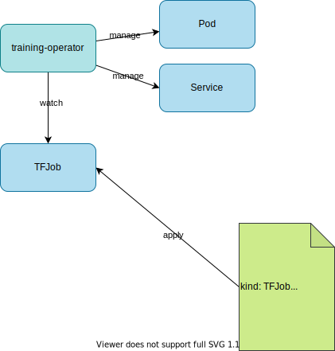
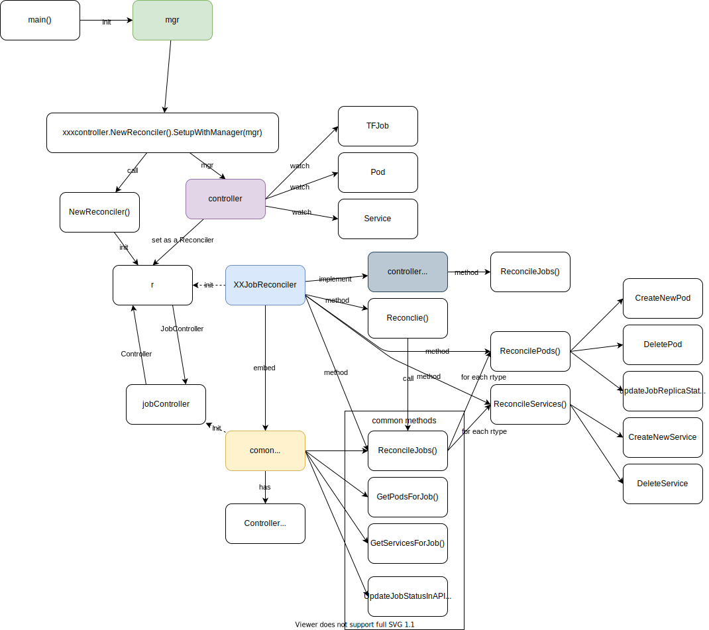

# [Training Operator](https://github.com/kubeflow/training-operator)

## Version

v1.3.0

## Overview

Training ML models in Kubeflow through operators.



1. Specify pod template for each `replicaType` (e.g. `Worker`, `Master`)
1. Pod template contains container image.

Question: If you need to specify container image that contains all the machine learning logic, why not just using a `Job`?
Answer: Manage distributed TensorFlow training jobs. -> Based on the `ReplicaType`.

## Install

```
kubectl apply -k "github.com/kubeflow/training-operator/manifests/overlays/standalone?ref=v1.3.0"
```

CRDs:
1. `mxjobs.kubeflow.org`
1. `pytorchjobs.kubeflow.org`
1. `tfjobs.kubeflow.org`
1. `xgboostjobs.kubeflow.org`

## 1. [TensorFlow Training (TFJob)](https://www.kubeflow.org/docs/components/training/tftraining/) - Simple

1. Start mnist example TFJob.
    ```
    kubectl create -f https://raw.githubusercontent.com/kubeflow/training-operator/master/examples/tensorflow/simple.yaml
    ```


    ```yaml
    apiVersion: "kubeflow.org/v1"
    kind: TFJob
    metadata:
      name: tfjob-simple
      namespace: kubeflow
    spec:
       tfReplicaSpecs:
         Worker:
           replicas: 2
           restartPolicy: OnFailure
           template:
             spec:
               containers:
                 - name: tensorflow
                   image: gcr.io/kubeflow-ci/tf-mnist-with-summaries:1.0
                   command:
                     - "python"
                     - "/var/tf_mnist/mnist_with_summaries.py"
    ```

    mnist example: https://github.com/kubeflow/training-operator/blob/master/examples/tensorflow/mnist_with_summaries/README.md

1. Check pods.
    ```
    kubectl get po -n kubeflow --show-labels
    NAME                                 READY   STATUS    RESTARTS   AGE   LABELS
    tfjob-simple-worker-0                1/1     Running   0          28s   group-name=kubeflow.org,job-name=tfjob-simple,job-role=master,replica-index=0,replica-type=worker
    tfjob-simple-worker-1                1/1     Running   0          28s   group-name=kubeflow.org,job-name=tfjob-simple,replica-index=1,replica-type=worker
    training-operator-7d98f9dd88-2d4x2   1/1     Running   0          88m   control-plane=kubeflow-training-operator,pod-template-hash=7d98f9dd88
    ```

    Pods:
    1. `training-operator`
    1. `tfjob-simple-worker-0` (replica-type=worker,replica-index=0,job-role=master)
    1. `tfjob-simple-worker-1` (replica-type=worker,replica-index=1)

1. Check TensorFlow logs.

    ```
    kubectl logs tfjob-simple-worker-0 -n kubeflow
    ```

    <details>

    ```
    WARNING:tensorflow:From /var/tf_mnist/mnist_with_summaries.py:39: read_data_sets (from tensorflow.contrib.learn.python.learn.datasets.mnist) is deprecated and will be removed in a future version.
    Instructions for updating:
    Please use alternatives such as official/mnist/dataset.py from tensorflow/models.
    WARNING:tensorflow:From /usr/local/lib/python2.7/dist-packages/tensorflow/contrib/learn/python/learn/datasets/mnist.py:260: maybe_download (from tensorflow.contrib.learn.python.learn.datasets.base) is deprecated and will be removed in a future version.
    Instructions for updating:
    Please write your own downloading logic.
    WARNING:tensorflow:From /usr/local/lib/python2.7/dist-packages/tensorflow/contrib/learn/python/learn/datasets/base.py:252: wrapped_fn (from tensorflow.contrib.learn.python.learn.datasets.base) is deprecated and will be removed in a future version.
    Instructions for updating:
    Please use urllib or similar directly.
    WARNING:tensorflow:From /usr/local/lib/python2.7/dist-packages/tensorflow/contrib/learn/python/learn/datasets/mnist.py:262: extract_images (from tensorflow.contrib.learn.python.learn.datasets.mnist) is deprecated and will be removed in a future version.
    Instructions for updating:
    Please use tf.data to implement this functionality.
    WARNING:tensorflow:From /usr/local/lib/python2.7/dist-packages/tensorflow/contrib/learn/python/learn/datasets/mnist.py:267: extract_labels (from tensorflow.contrib.learn.python.learn.datasets.mnist) is deprecated and will be removed in a future version.
    Instructions for updating:
    Please use tf.data to implement this functionality.
    WARNING:tensorflow:From /usr/local/lib/python2.7/dist-packages/tensorflow/contrib/learn/python/learn/datasets/mnist.py:290: __init__ (from tensorflow.contrib.learn.python.learn.datasets.mnist) is deprecated and will be removed in a future version.
    Instructions for updating:
    Please use alternatives such as official/mnist/dataset.py from tensorflow/models.
    2022-02-17 21:13:24.699002: I tensorflow/core/platform/cpu_feature_guard.cc:141] Your CPU supports instructions that this TensorFlow binary was not compiled to use: AVX2 FMA
    Successfully downloaded train-images-idx3-ubyte.gz 9912422 bytes.
    Extracting /tmp/tensorflow/mnist/input_data/train-images-idx3-ubyte.gz
    Successfully downloaded train-labels-idx1-ubyte.gz 28881 bytes.
    Extracting /tmp/tensorflow/mnist/input_data/train-labels-idx1-ubyte.gz
    Successfully downloaded t10k-images-idx3-ubyte.gz 1648877 bytes.
    Extracting /tmp/tensorflow/mnist/input_data/t10k-images-idx3-ubyte.gz
    Successfully downloaded t10k-labels-idx1-ubyte.gz 4542 bytes.
    Extracting /tmp/tensorflow/mnist/input_data/t10k-labels-idx1-ubyte.gz
    ...
    Accuracy at step 900: 0.9645
    Accuracy at step 910: 0.9665
    Accuracy at step 920: 0.9642
    Accuracy at step 930: 0.9673
    Accuracy at step 940: 0.9685
    Accuracy at step 950: 0.9661
    Accuracy at step 960: 0.9701
    Accuracy at step 970: 0.967
    Accuracy at step 980: 0.9677
    Accuracy at step 990: 0.9682
    Adding run metadata for 999
    ```

    </details>


## 2. [TFJob - example](https://github.com/kubeflow/training-operator/tree/master/examples/tensorflow/dist-mnist)

For local testing, use [kind](https://kind.sigs.k8s.io/) cluster.

```
kind create cluster
```

```
g clone https://github.com/kubeflow/training-operator
cd training-operator/examples/tensorflow/dist-mnist
```

```
docker build -f Dockerfile -t kubeflow/tf-dist-mnist-test:1.0 ./
```

```
kind load docker-image kubeflow/tf-dist-mnist-test:1.0
```

```
kubectl apply -f tf_job_mnist.yaml
```

```
kubectl get po,svc --show-labels
NAME                                   READY   STATUS    RESTARTS   AGE   LABELS
pod/dist-mnist-for-e2e-test-ps-0       1/1     Running   0          42s   group-name=kubeflow.org,job-name=dist-mnist-for-e2e-test,replica-index=0,replica-type=ps
pod/dist-mnist-for-e2e-test-ps-1       1/1     Running   0          42s   group-name=kubeflow.org,job-name=dist-mnist-for-e2e-test,replica-index=1,replica-type=ps
pod/dist-mnist-for-e2e-test-worker-0   1/1     Running   0          42s   group-name=kubeflow.org,job-name=dist-mnist-for-e2e-test,job-role=master,replica-index=0,replica-type=worker
pod/dist-mnist-for-e2e-test-worker-1   1/1     Running   0          42s   group-name=kubeflow.org,job-name=dist-mnist-for-e2e-test,replica-index=1,replica-type=worker
pod/dist-mnist-for-e2e-test-worker-2   1/1     Running   0          42s   group-name=kubeflow.org,job-name=dist-mnist-for-e2e-test,replica-index=2,replica-type=worker
pod/dist-mnist-for-e2e-test-worker-3   1/1     Running   0          42s   group-name=kubeflow.org,job-name=dist-mnist-for-e2e-test,replica-index=3,replica-type=worker

NAME                                       TYPE        CLUSTER-IP   EXTERNAL-IP   PORT(S)    AGE   LABELS
service/dist-mnist-for-e2e-test-ps-0       ClusterIP   None         <none>        2222/TCP   42s   group-name=kubeflow.org,job-name=dist-mnist-for-e2e-test,replica-index=0,replica-type=ps
service/dist-mnist-for-e2e-test-ps-1       ClusterIP   None         <none>        2222/TCP   42s   group-name=kubeflow.org,job-name=dist-mnist-for-e2e-test,replica-index=1,replica-type=ps
service/dist-mnist-for-e2e-test-worker-0   ClusterIP   None         <none>        2222/TCP   42s   group-name=kubeflow.org,job-name=dist-mnist-for-e2e-test,replica-index=0,replica-type=worker
service/dist-mnist-for-e2e-test-worker-1   ClusterIP   None         <none>        2222/TCP   42s   group-name=kubeflow.org,job-name=dist-mnist-for-e2e-test,replica-index=1,replica-type=worker
service/dist-mnist-for-e2e-test-worker-2   ClusterIP   None         <none>        2222/TCP   42s   group-name=kubeflow.org,job-name=dist-mnist-for-e2e-test,replica-index=2,replica-type=worker
service/dist-mnist-for-e2e-test-worker-3   ClusterIP   None         <none>        2222/TCP   42s   group-name=kubeflow.org,job-name=dist-mnist-for-e2e-test,replica-index=3,replica-type=worker
service/kubernetes                         ClusterIP   10.96.0.1    <none>        443/TCP    22d   component=apiserver,provider=kubernetes
```

Check how each worker and ps is run in local:

worker 0:
```
TF_CONFIG='{"cluster": { "ps": ["localhost:2222"], "worker": ["localhost:2223", "localhost:2224"]}, "task": {"type": "worker", "index": 0}}' python dist_mnist.py
```
worker 1:
```
TF_CONFIG='{"cluster": { "ps": ["localhost:2222"], "worker": ["localhost:2223", "localhost:2224"]}, "task": {"type": "worker", "index": 1}}' python dist_mnist.py
```

ps 0:
```
TF_CONFIG='{"cluster": { "ps": ["localhost:2222"], "worker": ["localhost:2223", "localhost:2224"]}, "task": {"type": "ps", "index": 0}}' python dist_mnist.py
```

## Controller Implemetation



- `TFJobReconciler` implements [common.ControllerInterface](https://github.com/kubeflow/common/blob/a86572b0e5d461c539b1452dbbff1caaec680b11/pkg/apis/common/v1/interface.go)
- `TFJobReconciler` embeds [JobController](https://github.com/kubeflow/common/blob/2b40c8f8991e302920ee5536c0ad49dec6724c66/pkg/controller.v1/common/job_controller.go#L85-L193) and [client.Client]() (ref: [embedding](https://go.dev/doc/effective_go#embedding))
    The embedded elements are pointers to structs that are set in [NewReconciler](https://github.com/kubeflow/training-operator/blob/6c115f6e00e3f2c979c6aa4bf2d93906a646b99d/pkg/controller.v1/tensorflow/tfjob_controller.go#L98-L127):
    - `Client`:
        ```go
        r := &TFJobReconciler{
            Client:   mgr.GetClient(), // here
            Scheme:   mgr.GetScheme(),
            recorder: mgr.GetEventRecorderFor(controllerName),
            Log:      log.Log,
        }
        ```
    - `JobController`:
        ```go
        r.JobController = common.JobController{
          Controller:                  r,
          Expectations:                expectation.NewControllerExpectations(),
          Config:                      common.JobControllerConfiguration{EnableGangScheduling: enableGangScheduling},
          WorkQueue:                   &util.FakeWorkQueue{},
          Recorder:                    r.recorder,
          KubeClientSet:               kubeClientSet,
          VolcanoClientSet:            volcanoClientSet,
          PriorityClassLister:         priorityClassInformer.Lister(),
          PriorityClassInformerSynced: priorityClassInformer.Informer().HasSynced,
          PodControl:                  control.RealPodControl{KubeClient: kubeClientSet, Recorder: r.recorder},
          ServiceControl:              control.RealServiceControl{KubeClient: kubeClientSet, Recorder: r.recorder},
        }
        ```
logic:
- TFJobReconciler watches the following Kubernetes resources ([SetupWithManager](https://github.com/kubeflow/training-operator/blob/9894d677f58ad9441fe37a670911ccbb92c72420/pkg/controller.v1/tensorflow/tfjob_controller.go#L190-L231))
    - `TFJob`: CreateFunc -> onOwnCreateFunc -> update Job Conditions.
    - `Pod`:
        - CreateFunc -> `util.OnDependentCreateFunc(r.Expectations)`
        - UpdateFunc -> `util.OnDependentUpdateFunc(&r.JobController)`
        - DeleteFunc -> `util.OnDependentDeleteFunc(r.Expectations)`
    - `Service`
        - CreateFunc -> `util.OnDependentCreateFunc(r.Expectations)`
        - UpdateFunc -> `util.OnDependentUpdateFunc(&r.JobController)`
        - DeleteFunc -> `util.OnDependentDeleteFunc(r.Expectations)`
- [TFJobReconciler.Reconcile](https://github.com/kubeflow/training-operator/blob/6c115f6e00e3f2c979c6aa4bf2d93906a646b99d/pkg/controller.v1/tensorflow/tfjob_controller.go#L146-L231)
    1. `validation.ValidateV1TFJobSpec(&tfjob.Spec)`: Validate replicaSpec:
        1. `len(container) != 0`
        1. At least one container named `tensorflow`.
        1. `chief/master` must not be more than 1.
    1. `jobKey, err := common.KeyFunc(tfjob)`: Check key (`<namespace>/<name>`) for the `TFJob`. (`KeyFunc`: DeletionHandlingMetaNamespaceKeyFunc](https://github.com/kubernetes/client-go/blob/7f0455096073f978a0f4b832c7ab10a0ed5a66b9/tools/cache/controller.go#L295) returns the key for the given object)
    1. `needReconcile := util.SatisfiedExpectations(r.Expectations, jobKey, replicaTypes)`: Check controller expectations about add/del of the managed pods and services
        <details><summary>ControllerExpectations</summary>

        ```go
        // Expectations are a way for controllers to tell the controller manager what they expect. eg:
        //	ControllerExpectations: {
        //		controller1: expects  2 adds in 2 minutes
        //		controller2: expects  2 dels in 2 minutes
        //		controller3: expects -1 adds in 2 minutes => controller3's expectations have already been met
        //	}
        //
        // Implementation:
        //	ControlleeExpectation = pair of atomic counters to track controllee's creation/deletion
        //	ControllerExpectationsStore = TTLStore + a ControlleeExpectation per controller
        //
        // * Once set expectations can only be lowered
        // * A controller isn't synced till its expectations are either fulfilled, or expire
        // * Controllers that don't set expectations will get woken up for every matching controllee
        ```

        For more details, [kubeflow/common/controller.v1/expectation/expectation.go](https://github.com/kubeflow/common/blob/master/pkg/controller.v1/expectation/expectation.go)
        </details>
    1. Cancel reconciliation if not satisfied or the TFJob has been deleted.
    1. `r.Scheme.Default(tfjob)`: Set default
    1. Call [`r.ReconcileJobs(tfjob, tfjob.Spec.TFReplicaSpecs, tfjob.Status, &tfjob.Spec.RunPolicy)`](https://github.com/kubeflow/training-operator/blob/6c115f6e00e3f2c979c6aa4bf2d93906a646b99d/pkg/controller.v1/tensorflow/tfjob_controller.go#L180) defined in `JobController`.
- [JobController.ReconcileJobs](https://github.com/kubeflow/common/blob/2b40c8f8991e302920ee5536c0ad49dec6724c66/pkg/controller.v1/common/job_controller.go#L74-L84) is implemented in [kubeflow/common/pkg/controller.v1/common/job.go](https://github.com/kubeflow/common/blob/ba4c24a7fb680fdfcfd1df26bf2e4ae205a29ddb/pkg/controller.v1/common/job.go#L55-L298)

    ```go
    // JobController abstracts other operators to manage the lifecycle of Jobs.
    // User need to first implement the ControllerInterface(objectA) and then initialize a JobController(objectB) struct with objectA
    // as the parameter.
    // And then call objectB.ReconcileJobs as mentioned below, the ReconcileJobs method is the entrypoint to trigger the
    // reconcile logic of the job controller
    //
    // ReconcileJobs(
    //		job interface{},
    //		replicas map[apiv1.ReplicaType]*apiv1.ReplicaSpec,
    //		jobStatus apiv1.JobStatus,
    //		runPolicy *apiv1.RunPolicy) error
    ```

    1. `pods, err := jc.Controller.GetPodsForJob(job)`: Get Pods for the job. `jc.Controller` means `JobController` given to TFJobController in the initialization.
    1. `services, err := jc.Controller.GetServicesForJob(job)`: Get Services for the job.
    1. If jobStatus is succeeded or failed:
        1. Delete the Pods and Services.
        1. Clean up the job if `TTLSecondsAfterFinished` is set.
        1. Update JobStatus.
        1. Return `nil`.
    1. Set `jobExceedsLimit` based on the condition.
    1. If `jobExceedsLimit` is true:
        1. Clean up and update job condition.
        1. Update JobStatus.
        1. Return `nil`.
    1. Else:
        1. [common.ReconcilePods](https://github.com/kubeflow/common/blob/ba4c24a7fb680fdfcfd1df26bf2e4ae205a29ddb/pkg/controller.v1/common/pod.go#L271) for each replica type (e.g. `Worker`, `PS`, `Chief`) with spec (e.g. replicas, Pod template): Create/Update/Delete based on given podTemplate.
            1. `pods, err = jc.FilterPodsForReplicaType(pods, rt)`: Get only target Pods for the given replica type.
            1. Decide action (add/remove/update).
                ```go
                // GetPodSlices will return enough information here to make decision to add/remove/update resources.
                //
                // For example, let's assume we have pods with replica-index 0, 1, 2
                // If replica is 4, return a slice with size 4. [[0],[1],[2],[]], a pod with replica-index 3 will be created.
                //
                // If replica is 1, return a slice with size 3. [[0],[1],[2]], pod with replica-index 1 and 2 are out of range and will be deleted.
                podSlices := jc.GetPodSlices(pods, numReplicas, logger)
                ```
                [core.GetPodSlices](https://github.com/kubeflow/common/blob/ba4c24a7fb680fdfcfd1df26bf2e4ae205a29ddb/pkg/core/pod.go#L37)
            1. For each slice in podSlices,
                - [TFJobReconciler.createNewPod](https://github.com/kubeflow/training-operator/blob/9894d677f58ad9441fe37a670911ccbb92c72420/pkg/controller.v1/tensorflow/tfjob_controller.go#L776) if the length is zero
                    1. Prepare labels (e.g. replica type, index, master, etc.)
                    1. `podTemplate := spec.Template.DeepCopy()`: Prepare Pod template from the spec defined in the CR (`TFJob.Spec.TFReplicaSpecs.<rtype>.ReplicaSpec.Template`)
                    1. Set a Pod name `jobName + "-" + strings.ToLower(rtype) + "-" + index`
                    1. Set labels.
                    1. [SetClusterSpec](https://github.com/kubeflow/training-operator/blob/6c115f6e00e3f2c979c6aa4bf2d93906a646b99d/pkg/controller.v1/tensorflow/tfjob_controller.go#L576-L610) to TF_CONFIG environment variable in tensorflow container. (tested in [pod_test.go](https://github.com/kubeflow/training-operator/blob/6c115f6e00e3f2c979c6aa4bf2d93906a646b99d/pkg/controller.v1/tensorflow/pod_test.go#L44-L97))
                    1. Set restartPolicy.
                    1. Set `Spec.SchedulerName` to `"volcano"` and annotations if `EnableGangScheduling` is true.
                    1. `jc.Expectations.RaiseExpectations(expectationPodsKey, 1, 0)`: RaiseExpectations (ToDo: check this)
                    1. Create `OwnerReference`
                    1. [`err = jc.PodControl.CreatePodsWithControllerRef(metaObject.GetNamespace(), podTemplate, runtimeObject, controllerRef)`](https://github.com/kubeflow/common/blob/ba4c24a7fb680fdfcfd1df26bf2e4ae205a29ddb/pkg/controller.v1/common/pod.go#L451): Create a Pod
                - `DeletePod` if index > replicaNum, and
                - `updateJobReplicaStatuses` (update the counter of `Active`, `Succeeded`, `Failed` for the replica type.).
        1. [common.ReconcileServices](https://github.com/kubeflow/common/blob/34276e9d2ffa39f5922479bff87dc5ed5ed94cfb/pkg/controller.v1/common/service.go#L156): almost same as `ReconcilePods`.
    1. Update JobStatus.
    1. Return `nil`.


## References
- [eks-kubeflow-workshop/notebooks/03_Distributed_Training](https://github.com/aws-samples/eks-kubeflow-workshop/blob/master/notebooks/03_Distributed_Training/distributed_training.md)
- [Amazon EKS Workshop > Advanced > Machine Learning using Kubeflow](https://www.eksworkshop.com/advanced/420_kubeflow/)
- [A friendly introduction to distributed training (ML Tech Talks)](https://www.youtube.com/watch?v=S1tN9a4Proc)
- [MirroredStrategy demo for distributed training](https://www.youtube.com/watch?v=xzSCvXDcX68)
- [Optimize training performance with Reduction Server on Vertex AI](https://cloud.google.com/blog/topics/developers-practitioners/optimize-training-performance-reduction-server-vertex-ai)
- https://www.tensorflow.org/tutorials/distribute/parameter_server_training
